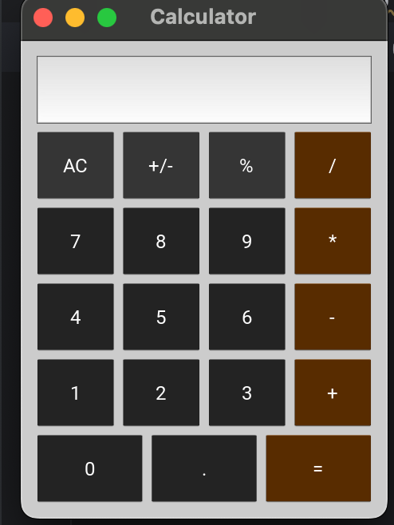

# mycalculator-kivy
# Calculator with Kivy

## Description
A simple calculator built with the Kivy framework in Python.

## Features
- Basic operations (addition, subtraction, multiplication, division)
- Change sign (+/-)
- Percentage (%)
- Clear (AC)
- Evaluation of mathematical expressions

## Screenshots

## Installation
1. Make sure you have Python installed on your system.
2. Install dependencies with the command:
    ```bash
    pip install kivy
    ```

## Usage
1. Clone the repository:
    ```bash
    git clone https://github.com/LEAMAFIKA/mycalculator-kivy.git
    ```

2. Navigate to the project directory:
    ```bash
    cd mycalculator-kivy
    ```

3. Run the application:
    ```bash
    python main.py
    ```

## Contributing
If you wish to contribute to this project, follow these steps:
1. Fork the project.
2. Create a branch for your feature (`git checkout -b new-feature`).
3. Commit your changes (`git commit -m 'Added a new feature'`).
4. Push to the branch (`git push origin new-feature`).
5. Create a new Pull Request.

## Author
Leaticia Mafika

## License
This project is licensed under the open source.